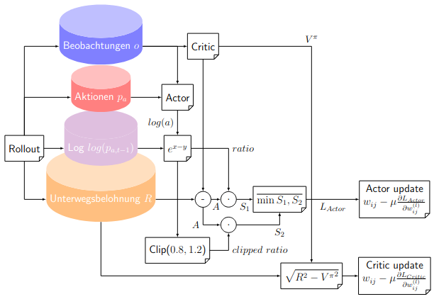
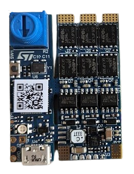

# Quadstar

Quadstar is a project which includes python classes for simulating and training a quadcopter system. Furthermore a basic PID flight controller implementation is provided in the folder ```./quadsoft/``` for STM32F411 processors including KiCad shematics. 
With the help of the functionality a quadcopter prototyp has beeing build, mainly for fun and research purposes. Future work may include the development of fixed wing simulation functionality.


## Controller architectures

Noumerous controller architectures are known from control theory. For example one can employ model predictive or robust control on a quadcopter plant controlling problem. Consumer grade quadcopters often make use of PID control, mainly due to ease of use and implementation.

### PID controller

I used a quaternion based PID controller for my quadcopters.

The PID controller as well as the flight dynamic model inplementation from [quadcopter_simcon](https://github.com/bobzwik/Quadcopter_SimCon) have been modified for this repository. Big thanks to the creator.  

### End2end policy

Another approach to quadcopter control is employing a nonlinear network of weights. Deep reinforcement learning can be used to train the policy network. Proximal policy optimization (PPO) is has been used in this repo. Currently the training process is still ongoing. 



## Drivetrain

### BLDC-motors

The following motors are currently being used on my quadcopter model Axisflying C227 1960KV FPV Motor schwarz and I can recommend them. They even worked fine with a 11.2V (S3) power source while the specification recommends 22.2V (S6). It is probably wise to go with the specification for a build. So did I at least. 

### BLDC-driver

Following troubles with other ESCs I found out about the B-G431B-ESC1. I can recommend it but it a little bit of electronics and programming knowledge to get up and running.



When using the provided tools by ST for configuration a Windows OS is needed at the time of writing. 

Using the following software, MCSDK, Motor Profiler and STM32CubeIDE provided by ST the B-G431B-ESC1 board can be programmed.
 
### Akkumulator

## Information flow system

### Main compute unit (MCU)

The core of the system is an STM32F411RE microcontroller which computes all processes required for the flight controller, which includes sensor fusion.

### Main sensor unit (MSU)

X-NUCLEO-IKS4A1

## Simulation

### Configuration

All volatile parameters on the user side can be controlled from a single file.
When a new model is trained the current config is used for training and is saved in the SQLite database models/config.db.

### Plot of quadcopter trajectories

The program quadtest.py can be used to create matplotlib-plots of position, velocity and attitude trajectories from simulation:

```python3 quadtest.py```

### Visualize the quadcopter in the browser with flask

Quadlive provides two functionalities.

```python3 quadlive.py```

### Train models with Stable-Baselines3

To train the a quadcopter flight controller on the current configuration run ```python3 quadtrain.py```.

## Delopyment

### Joystick

To sample joystick values and send them to the main flight computer run ```python3 joystick.py```.


