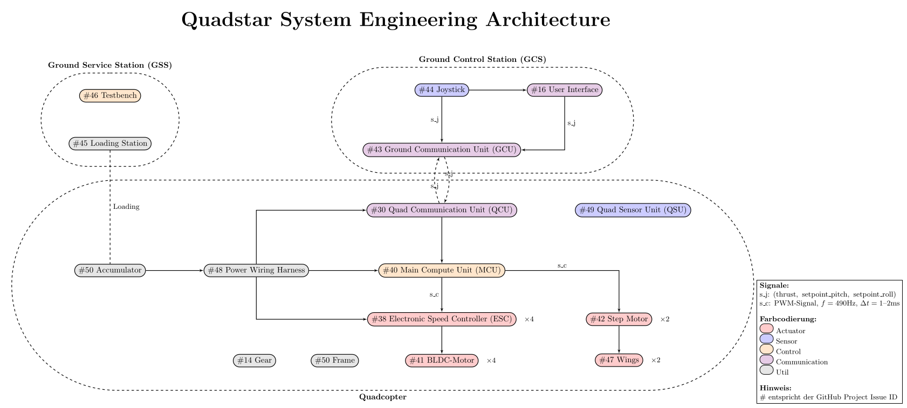

# Thetafly

## Description

Thetafly is a project which includes python classes for simulating a quadcopter system. 
With the help of the functionality a quadcopter prototyp has beeing build, mainly for fun and research purposes. Future work may include the development of fixed wing simulation functionality.


## Architecture



### Controller architectures

Noumerous controller architectures are known from control theory. For example one can employ model predictive or robust control on a quadcopter plant controlling problem. Consumer grade quadcopters often make use of PID control, mainly due to ease of use and implementation.

### PID controller

I used a quaternion based PID controller for my quadcopters.

The PID controller as well as the flight dynamic model inplementation from [quadcopter_simcon](https://github.com/bobzwik/Quadcopter_SimCon) have been modified for this repository. Big thanks to the creator.  

## Drivetrain

### BLDC-motors

The following motors are currently being used on my quadcopter model Axisflying C227 1960KV FPV Motor schwarz and I can recommend them. They even worked fine with a 11.2V (S3) power source while the specification recommends 22.2V (S6). It is probably wise to go with the specification for a build. So did I at least. 
 
### Akkumulator

## Information flow system

### Main compute unit (MCU)

The core of the system is an STM32F411RE microcontroller which computes all processes required for the flight controller, which includes sensor fusion.

### Main sensor unit (MSU)

X-NUCLEO-IKS4A1

## Simulation

### Configuration

All volatile parameters on the user side can be controlled from a single file.
When a new model is trained the current config is used for training and is saved in the SQLite database models/config.db.

```PYTHONPATH=src poetry run python -m simulation.main```

## Delopyment

### Joystick

To sample joystick values and send them to the main flight computer run:

```PYTHONPATH=src poetry run python -m util.joystick```.

