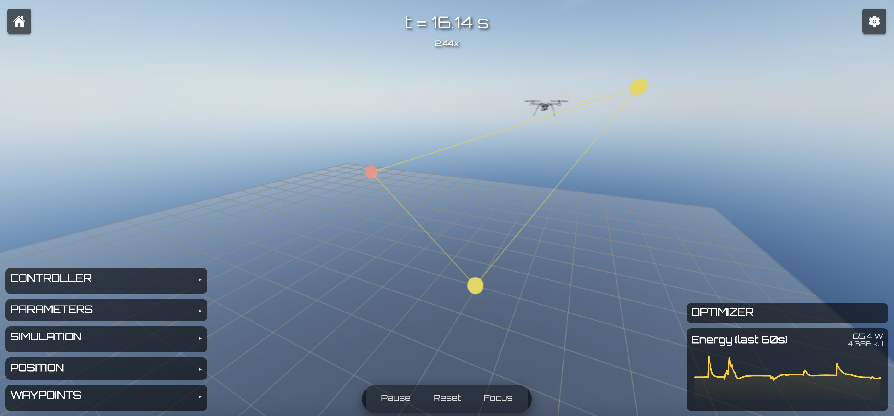

# Thetafly

## Description

Thetafly is a project which includes python classes for simulating a quadcopter system. The simulation software is in a prototype stage with a lot of bugs still to be fixed and furture deep testing required.
With the help of the functionality a quadcopter prototyp has beeing build, mainly for fun and research purposes. The hardware is mostly finished but a lot of firmware still has to be written before flight testing can begin.


## Architecture


## Simulation



### Configuration

Make sure you setup a pyenv with the libs defined in pyproject.toml:

```pyenv activate thetafly```

Post activation of the pyenv you can simply run the simulator with a bash script:

```bash start.sh```

## Delopyment

### Joystick

To sample joystick values and send them to the main flight computer run:

```PYTHONPATH=src poetry run python -m util.joystick```.

